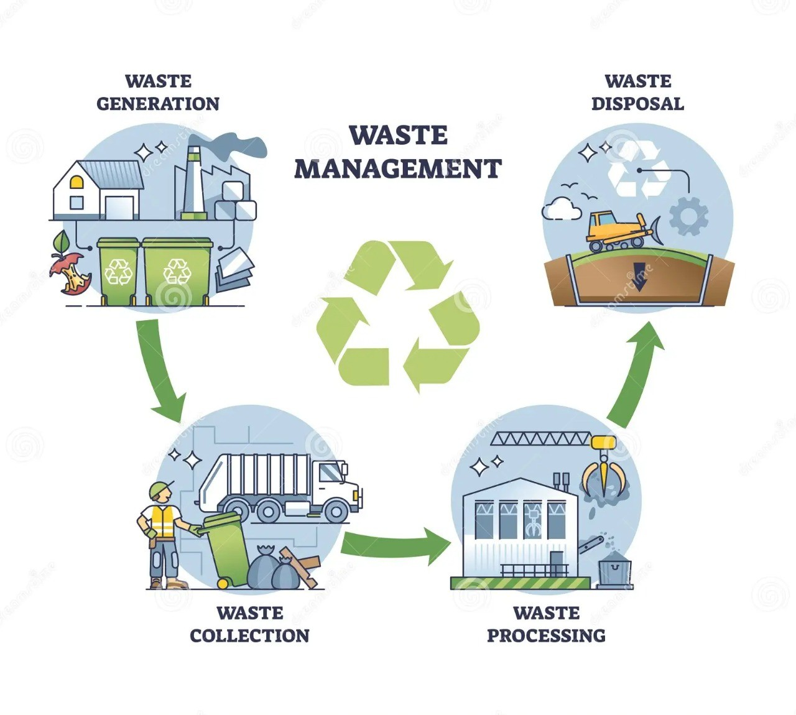

# Waste Management And Recycling Automation
# Welcome to My Project

## The Waste Management and Recycling Automation Project

The Waste Management and Recycling Automation project is designed to address the growing challenges of waste disposal and recycling. It features four key modules:

- **Waste Generation Monitoring:** Tracks and logs waste production in real-time.
- **Route Optimization:** Ensures efficient planning for collection vehicles to minimize fuel usage and operational costs.
- **Waste Classification:** Segregates waste into specific types for recycling or disposal.
- **Selling Recycled Products:** Focuses on marketing and selling recycled materials and eco-friendly products to promote a circular economy.

This system aims to enhance sustainability, reduce environmental impact, and optimize waste management processes.
     
# wastemanagement.github.io  

## Portfolio

### Hello, Nagendra vernekar 👋

I am passionate about technology and problem-solving. Here's a glimpse of my work:

## 🛠 Projects
- Project : A Waste Management and Recycling Automation System include 4 modules:**Waste generation monitoring**(monitors waste generation), **Route optimization**(planning and executing the  most efficient routes for waste collection vehicle), **Waste Classification**(segregate all the waste and send it to particular industry), and **Selling Recycled Products**(Sell the recycled products). The Waste Management and Recycling Automation system streamlines waste handling through efficient monitoring, classification, and collection routes. It also promotes sustainability by recycling materials and selling eco-friendly products.

# Waste Management and Recycling Automation

This project focuses on automating waste management processes, including:

- **Waste Generation Monitoring**
- **Route Optimization**
- **Waste Classification**
- **Selling Recycled Products**

## View the Code

You can view the complete code for the project here:

[View My Code](MYCODE.MD)

## 🚀 Skills
- C++, Python, JavaScript
- Data Structures and Algorithms
- Web Development (React.js, Node.js)

## 🌐 Find Me Online
- [GitHub](https://github.com/nagendraveer)

## Portfolio Topic

<dl>
<dt>Course Name</dt>
<dd>Algorithm Lab</dd>
<dt>Course Code</dt>
<dd>24ECSP205</dd>
<dt>Name</dt>
<dd>Nagendra vernekar</dd>
<dt>SRN</dt>
<dd>02FE23BCS002</dd>
<dt>Course Instructor</dt>
<dd>Prof.Vaishali Parab and Ms. Manasi N </dd>
<dt>University</dt>
<dd>KLE Technological University</dd>
<dt>Waste Management and Recycling Automation/COMPUTER SCIENCE</dt>
</dl>

  
> “The only way to do great work is to love what you do.” – Steve Jobs
>
